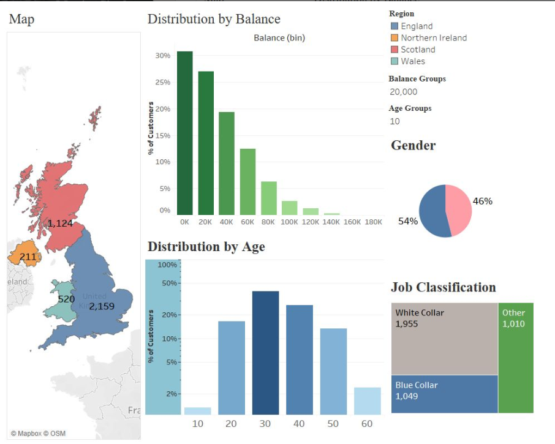

# 🇬🇧 Unlocking the Secrets of UK Customers: A Tableau Deep Dive  
**Exploring Customer Demographics and Market Share Across the United Kingdom**

---

## 🧠 Overview  
This project explores **UK customer data** through an interactive Tableau dashboard, analysing patterns in **regional market share, demographics, income distribution, and job roles**.  
By visualising insights across **England, Scotland, Wales, and Northern Ireland**, the dashboard reveals unique customer behaviours that can inform business and marketing strategies.

---

## 🚀 Project Objective  
To identify **key demographic and regional insights** within UK customer data and highlight **market opportunities** using Tableau’s visual analytics capabilities.

---

## 📊 Key Insights  

- **Regional Disparities:** England dominates market share, while other regions show potential for growth.  
- **Age Demographics:** Customers in their 30s form the largest segment, but the 40+ category is expanding steadily.  
- **Balancing Act:** A significant portion of customers maintain lower account balances — reflecting **income inequality and untapped opportunities**.  
- **Diverse Customer Profiles:** Distinct patterns across **job roles and gender distributions** provide guidance for **targeted marketing strategies**.

---

## 🔄 Interactivity  
The dashboard includes **filters, colour-coded maps, and dynamic elements**, enabling users to explore patterns by **region, gender, and job role** interactively.

---

## 🛠️ Tools Used  
- **Tableau Desktop** (data modelling and dashboard creation)  
- **Microsoft Excel** (data preparation)  

---

## 📸 Dashboard Preview  
*(Upload your Tableau dashboard image and replace the path below once added)*  

---

## 🔗 View the Live Dashboard  
Explore it here → [UK Customer Insights Dashboard](https://lnkd.in/dnarCJbJ)

---

## 💡 Key Learnings  
- Improved understanding of **regional market segmentation** and **customer profiling**.  
- Hands-on experience with **interactive dashboards and geospatial visualisation**.  
- Developed skills in **data-driven storytelling** for business insights.

---

## 🔗 Connect with Me  
Let’s connect to discuss analytics, Tableau, and customer insight strategies:  
👉 [LinkedIn – Manjot Singh](https://www.linkedin.com/in/manjotsingh0904)

---

⭐ *An analytical deep dive into the UK market — turning data into stories that drive decisions!*
